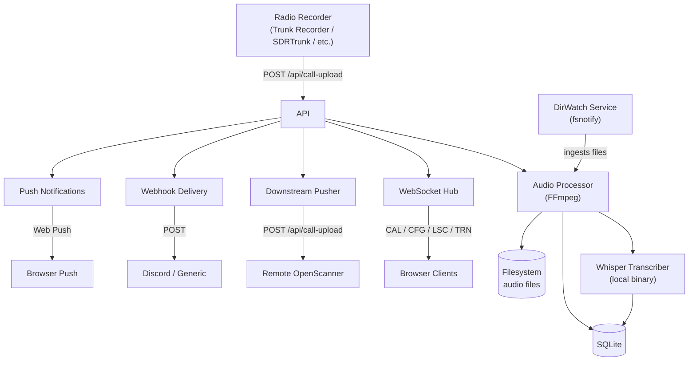

# OpenScanner — Architecture

> Core architecture established in Phase 1. Detailed component documentation to be expanded in Phase 14.

## Overview

OpenScanner is a modern web-based radio call manager inspired by rdio-scanner. It uses a Go backend (Gin + SQLite) with a React frontend (TypeScript + DaisyUI), connected via WebSocket for real-time call streaming.

## System Diagram

## Components

- **backend/cmd/server** — Application entry point + CLI subcommands (login, config-get/set, user-add/remove); graceful shutdown via `context.WithCancel`
- **backend/internal/api** — Gin route handlers including health check (`GET /api/health`)
- **backend/internal/ws** — WebSocket hub and client management; permessage-deflate compression; binary audio frames
- **backend/internal/audio** — FFmpeg pipeline (4 conversion modes), duplicate detection, bounded worker pool, Whisper transcription worker
- **backend/internal/dirwatch** — Directory watching (fsnotify + polling fallback) and file parsing
- **backend/internal/downstream** — Call forwarding to remote instances
- **backend/internal/notify** — Web Push notification delivery via webpush-go
- **backend/internal/auth** — JWT (with role claims) and bcrypt; RBAC enforcement (admin/listener roles); public access mode (unauthenticated listening when enabled)
- **backend/internal/config** — Server startup configuration (CLI flags, env vars, INI file)
- **backend/internal/middleware** — Gin middleware: JWT auth, API key auth, rate limiting, request ID (UUID v4)
- **backend/internal/seed** — First-run database seeding (settings, default groups, default tags, app_state)
- **frontend/src/pages/Scanner** — Main scanner UI
- **frontend/src/pages/Admin** — Admin dashboard (virtual scrolling for large lists)
- **frontend/src/pages/Setup** — First-run setup wizard
- **frontend/src/pages/SharedCall** — Public shareable call player page
- **frontend/sw.ts** — Service Worker for PWA app-shell caching + push notification handling
