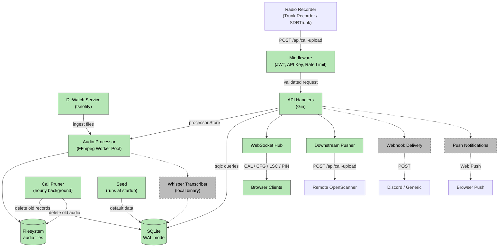

# OpenScanner — Architecture

> **Implementation status:** Phases 1–10 (Foundation, Database Schema, Backend Auth/RBAC/Setup, Call Ingest, WebSocket Hub, Admin CRUD APIs, DirWatch Service, Downstream Pusher, Frontend Scanner UI, Frontend TG Selection & Search Panels) are complete. Packages marked _(stub)_ below exist as empty package declarations and will be implemented in later phases.

## Overview

OpenScanner is a modern web-based radio call manager inspired by rdio-scanner. It uses a Go backend (Gin + SQLite) with a React frontend (TypeScript + DaisyUI), connected via WebSocket for real-time call streaming.

## System Diagram

The diagram below shows the full planned architecture. Solid lines and green fills indicate implemented components; dashed lines and grey fills indicate stubs not yet implemented.



## Components

### Implemented

- **backend/cmd/server** — Application entry point; loads config, opens DB, runs migrations, seeds defaults, starts Gin HTTP server with timeouts (`ReadHeaderTimeout`, `ReadTimeout`, `WriteTimeout`, `IdleTimeout`); graceful shutdown via `signal.NotifyContext` + error channel
- **backend/internal/api** — Gin route handlers: health check (`GET /api/health`), first-run setup (`GET /api/setup/status`, `POST /api/setup`), auth (`POST /api/auth/login`, `POST /api/auth/logout`, `PUT /api/auth/password`, `GET /api/auth/me`), admin CRUD (full CRUD for users, systems, talkgroups, units, groups, tags, apikeys, accesses, dirwatches, downstreams, webhooks), admin config (`GET/PUT /api/admin/config`), admin logs (`GET /api/admin/logs`), CSV import (`POST /api/admin/import/talkgroups`, `POST /api/admin/import/units`), JSON config export/import (`GET /api/admin/export/config`, `POST /api/admin/import/config`)
- **backend/internal/auth** — JWT HS256 (32-byte random secret, 24h expiry, UUID v4 JTI); bcrypt cost 12; `TokenTracker` with max-5 tokens per user (oldest evicted); `RateLimiter` (3 failures → 10-min lockout per IP); timing-safe login with `DummyHash`
- **backend/internal/config** — Server startup configuration (CLI flags, env vars, optional INI file); precedence: CLI > env > INI > defaults
- **backend/internal/middleware** — Gin middleware: `RequestID` (UUID v4), `Logger` (structured slog), `JWTAuth` (validates token + checks revocation), `OptionalJWTAuth` (extracts JWT if present but allows unauthenticated access for public endpoints), `RequireAdmin` (role-based 403), `APIKeyAuth` (header or query param), `RateLimit` (429 on lockout)
- **backend/internal/seed** — First-run database seeding: 1 `app_state` row, 30 settings, 6 groups (Air/EMS/Fire/Interop/Law/Unknown), 9 tags; all idempotent (`INSERT OR IGNORE`) in a single transaction
- **backend/internal/db** — SQLite WAL mode, embedded migrations (18 tables), `SetMaxOpenConns(1)`; sqlc-generated type-safe query layer

- **backend/internal/audio** — FFmpeg audio conversion pipeline: `Processor.Store` writes uploaded multipart file to `{audioDir}/{YYYY}/{MM}/{DD}/`, submits a `ConversionJob` to the bounded `WorkerPool` (`runtime.NumCPU()` goroutines), waits for completion, then returns the relative `.m4a` path; `IsDuplicate` queries the last call per system+talkgroup within the configured time window; `PruneLoop` runs on a 1-hour ticker deleting old calls and audio files in 500-row batches
- **backend/internal/api/calls.go** — `PostCallUpload` handler: validates API key (via `APIKeyAuth` middleware), applies per-API-key sliding-window rate limiter (default 60 req/min), parses multipart fields, resolves or auto-populates system+talkgroup, runs duplicate check, stores audio via `Processor.Store`, inserts call DB record, broadcasts `CAL` + binary audio to WS hub, returns `{"id": <callID>}`; also registered as `POST /api/trunk-recorder-call-upload`
- **backend/internal/api/calls.go** — `GetCalls` handler: paginated call archive search via `GET /api/calls`; supports filtering by `system_id`, `talkgroup_id`, `date_from`, `date_to` with `page`/`limit` pagination and `sort` direction (asc/desc); uses `OptionalJWTAuth` middleware (returns bookmark status when JWT is present); returns `{"calls": [...], "total": N}`

- **backend/internal/ws** — Real-time WebSocket hub for call streaming and client management:
  - **hub.go** — `Hub` struct runs a single-goroutine event loop processing `register`, `unregister`, and `broadcast` channels; non-blocking sends (slow clients dropped); `BroadcastCAL()` sends text + binary frames atomically per client (mutex-protected); `debounceLSC()` limits listener-count broadcasts to max 1 per 3 seconds via `time.AfterFunc`; graceful shutdown via context cancellation + `closeAll()`
  - **client.go** — `Client` struct with `readPump`/`writePump` goroutines; `HandleListenerWS` supports three auth flows: public access, `PIN` access code, or listener JWT; enforces `maxClients`, per-user `limit`, and per-access-code `limit`; `HandleAdminWS` validates admin JWT via `?token=` query param; `CanReceive(systemID, talkgroupID)` filters per-client grants
  - **messages.go** — Command constants (`CAL`, `CFG`, `VER`, `LSC`, `XPR`, `MAX`, `PIN`, `LFM`, `LCL`, `TRN`) with typed builder functions; `ParseCommand` extracts command + payload from JSON array messages
  - **Routes:** `GET /ws` (listener), `GET /api/admin/ws` (admin); registered via `gin.WrapF` in `api/routes.go`
  - **Compression:** permessage-deflate via `websocket.CompressionContextTakeover`

- **backend/internal/downstream** — Call forwarding service that pushes accepted calls to remote OpenScanner instances:
  - **pusher.go** — `Service` struct with fan-out pattern: one goroutine per active (non-disabled) downstream config, each with a buffered channel (1000 events); `Start` loads downstream configs from DB and spawns goroutines; `Reload` stops all pushers and restarts from DB (triggered by admin CRUD create/update/delete); `Stop` cancels context and drains goroutines after HTTP server shutdown
  - **Grant filtering:** `systems_json` column on each downstream controls which calls are forwarded — only calls matching the downstream's system/TG grants are enqueued
  - **Multipart POST:** Each call is re-posted as `multipart/form-data` to the remote instance's `/api/call-upload` endpoint with `X-API-Key` header authentication; audio file is read from the local filesystem
  - **Retry with backoff:** Exponential backoff on HTTP failure: 1s → 2s → 4s → 8s → 30s cap, max 5 retries per event, with random jitter to avoid thundering herd
  - **Security:** HTTP client configured with `CheckRedirect` returning error (SSRF protection — prevents following redirects to internal services); audio file paths validated against path traversal (`../`)
  - **Graceful shutdown:** `dsService.Stop()` is called after the HTTP server has completed shutdown, ensuring in-flight pushes complete before exit

- **backend/internal/dirwatch** — Directory watching service for automatic call ingest from local recorder output directories:
  - **watcher.go** — `Service` struct managing one goroutine per active dirwatch config; `Start` loads configs from DB, `Reload` stops all watchers and restarts fresh (called by admin CRUD after config changes); `runWithFsnotify` uses kernel inotify/kqueue `Create` events; `runWithPolling` scans on a configurable ticker (≥500 ms floor, suitable for CIFS/NFS mounts); `handleFile` enforces path traversal checks and extension filtering before dispatching to the parser; `ingestCall` mirrors the HTTP upload pipeline: system/TG resolution (with `autoPopulate`), duplicate check, `Processor.StoreFile`, DB insert, WS `CAL` broadcast, optional source-file deletion (`delete_after=1`)
  - **parsers.go** — `ParsedCall` struct + one `ParseFunc` per recorder type: `trunk-recorder` (JSON sidecar + audio file pair), `sdrtrunk` (`<sysID>_<tgID>_<ts>.<ext>` filename pattern), `rtlsdr-airband` (audio file, IDs from dirwatch config), `dsdplus` (audio file, IDs from dirwatch config), `proscan` (audio file, IDs from dirwatch config), `voxcall` (audio file, IDs from dirwatch config); unrecognised types fall back to `parseGeneric`
  - **mask.go** — `MaskTokens` struct + `ExpandMask`/`TokensFromCall`: expands `#DATE`, `#TIME`, `#ZTIME`, `#GROUP`, `#SYSLBL`, `#TAG`, `#TGAFS`, `#UNIT`, `#TGLBL`, `#TGHZ`, `#TGKHZ`, `#TGMHZ`, `#TGID` tokens in directory mask strings

### Stubs (package declaration only — not yet implemented)

- **backend/internal/audio/transcriber.go** — Whisper transcription worker pool
- **backend/internal/notify** — Web Push notification delivery

### Frontend — Scanner UI (Phase 9)

#### State Management

- **frontend/src/app/store.ts** — Redux store combining `scannerSlice`, `authSlice`, and RTK Query `api` reducers
- **frontend/src/app/slices/scannerSlice.ts** — Full scanner state with 18 reducers: `callReceived`, `skipCall`, `togglePause`, `toggleLive`, `holdSystem`, `holdTG`, `addAvoid`, `removeAvoid`, `toggleTG`, `setBranding`, `transcriptReceived`, queue management, and history tracking
- **frontend/src/app/slices/authSlice.ts** — Auth state: `setCredentials` (JWT + user), `clearCredentials`, `setSetupStatus`
- **frontend/src/app/slices/callsSlice.ts** — Search filter state: system, talkgroup, group, tag, date range, sort direction; drives SearchPanel query params
- **frontend/src/app/api.ts** — RTK Query base API with `getSetupStatus`, `postSetup`, `postLogin` endpoints; `getCalls` query for paginated call archive search

#### WebSocket Client

- **frontend/src/services/wsClient.ts** — Singleton WebSocket client connecting to `/ws`:
  - Auto-reconnect with exponential backoff (1 s → 30 s cap) plus random jitter
  - Handles text commands (`CAL`, `CFG`, `VER`, `LSC`, `XPR`, `MAX`, `TRN`) and binary audio frames
  - Runtime payload validation before dispatching to Redux
  - Supports three auth modes: public access (no auth), PIN access code, or listener JWT

#### Audio Player

- **frontend/src/services/audioPlayer.ts** — Singleton audio player:
  - `HTMLAudioElement` for playback with Web Audio API `GainNode` for volume control
  - Bounded call queue (max 50) with preloading of the next queued call
  - Download support and `clearQueue` for memory leak prevention

#### Hooks

- **useWebSocket** — WS lifecycle tied to auth state (connect/disconnect on login/logout)
- **useAudioPlayer** — Wires audio player callbacks (play, end, error) to Redux actions
- **useTheme** — Dark/light theme toggle with `localStorage` persistence
- **useScanner** — Composite hook combining WebSocket, audio player, and scanner state

#### Components

```
Scanner.tsx (lazy-loaded page)
├── LEDPanel          — Branding text + theme toggle + colored LED (green=live, orange=paused, pulse=idle)
├── DisplayPanel      — 8-row monospace display with clock; fullscreen modal on double-click
├── TranscriptPanel   — Collapsible transcript display (below DisplayPanel)
├── HistoryPanel      — Last 5 calls table
├── ControlToolbar    — Two-row icon toolbar
│   ├── Row 1: play/pause, skip, replay, LIVE toggle, volume slider
│   └── Row 2: HOLD (system/TG), AVOID, download
├── BookmarkButton    — Star toggle on current call
├── SelectTGPanel     — Slide-out panel for talkgroup selection (tri-state group toggles, per-system TG toggles, avoid countdown; state persisted to localStorage)
└── SearchPanel       — Slide-out panel for call archive search (RTK Query paginated results via GET /api/calls, filters by system/TG/group/tag/date, play/download per row)
```

#### Pages

- **Scanner.tsx** — Main layout assembling all scanner components (lazy-loaded)
- **Login.tsx** — Auth flow with password-change enforcement on first login
- **Setup.tsx** — First-run wizard (`POST /api/setup` → redirect to login)

#### PWA

- **frontend/public/manifest.json** — PWA manifest (`display: standalone`, dark theme color)
- **frontend/sw.ts** — Service Worker: network-first for API requests, cache-first for static assets (HTML, JS, CSS, fonts)

#### Tests

- 61 unit tests across `scannerSlice.test.ts`, `LEDPanel.test.tsx`, and `ControlToolbar.test.tsx` (Vitest + React Testing Library)

### Frontend — Stubs (not yet implemented)

- **frontend/src/pages/Admin.tsx** — Admin dashboard (placeholder)
- **frontend/src/pages/SharedCall.tsx** — Public shareable call player (placeholder)
