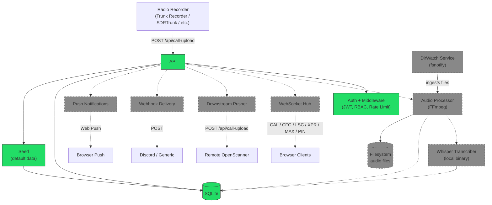

# OpenScanner — Architecture

> **Implementation status:** Phases 1–3 (Foundation, Database Schema, Backend Auth/RBAC/Setup) are complete. Packages marked _(stub)_ below exist as empty package declarations and will be implemented in later phases.

## Overview

OpenScanner is a modern web-based radio call manager inspired by rdio-scanner. It uses a Go backend (Gin + SQLite) with a React frontend (TypeScript + DaisyUI), connected via WebSocket for real-time call streaming.

## System Diagram

The diagram below shows the full planned architecture. Solid borders indicate implemented components; dashed borders indicate stubs not yet implemented.

## Components

### Implemented

- **backend/cmd/server** — Application entry point; loads config, opens DB, runs migrations, seeds defaults, starts Gin HTTP server with timeouts (`ReadHeaderTimeout`, `ReadTimeout`, `WriteTimeout`, `IdleTimeout`); graceful shutdown via `signal.NotifyContext` + error channel
- **backend/internal/api** — Gin route handlers: health check (`GET /api/health`), first-run setup (`GET /api/setup/status`, `POST /api/setup`), auth (`POST /api/auth/login`, `POST /api/auth/logout`, `PUT /api/auth/password`, `GET /api/auth/me`)
- **backend/internal/auth** — JWT HS256 (32-byte random secret, 24h expiry, UUID v4 JTI); bcrypt cost 12; `TokenTracker` with max-5 tokens per user (oldest evicted); `RateLimiter` (3 failures → 10-min lockout per IP); timing-safe login with `DummyHash`
- **backend/internal/config** — Server startup configuration (CLI flags, env vars, optional INI file); precedence: CLI > env > INI > defaults
- **backend/internal/middleware** — Gin middleware: `RequestID` (UUID v4), `Logger` (structured slog), `JWTAuth` (validates token + checks revocation), `RequireAdmin` (role-based 403), `APIKeyAuth` (header or query param), `RateLimit` (429 on lockout)
- **backend/internal/seed** — First-run database seeding: 1 `app_state` row, 30 settings, 6 groups (Air/EMS/Fire/Interop/Law/Unknown), 9 tags; all idempotent (`INSERT OR IGNORE`) in a single transaction
- **backend/internal/db** — SQLite WAL mode, embedded migrations (18 tables), `SetMaxOpenConns(1)`; sqlc-generated type-safe query layer

### Stubs (package declaration only — not yet implemented)

- **backend/internal/ws** — WebSocket hub, client management, message types
- **backend/internal/audio** — FFmpeg audio conversion, duplicate detection, worker pool, Whisper transcription
- **backend/internal/dirwatch** — Directory watching (fsnotify) and file parsing
- **backend/internal/downstream** — Call forwarding to remote instances
- **backend/internal/notify** — Web Push notification delivery

### Frontend (scaffolded — no UI implementation yet)

- **frontend/src/pages/Scanner.tsx** — Main scanner UI (placeholder)
- **frontend/src/pages/Admin.tsx** — Admin dashboard (placeholder)
- **frontend/src/pages/Setup.tsx** — First-run setup wizard (placeholder)
- **frontend/src/pages/SharedCall.tsx** — Public shareable call player (placeholder)
- **frontend/src/pages/Login.tsx** — Login page (placeholder)
